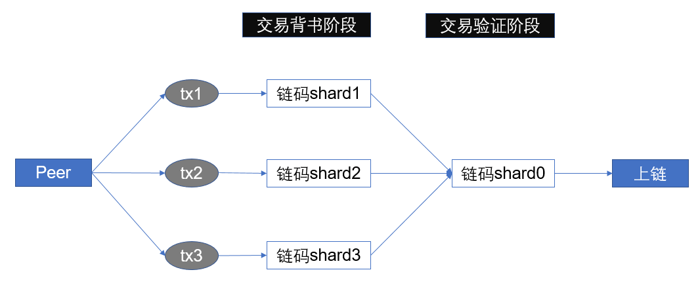
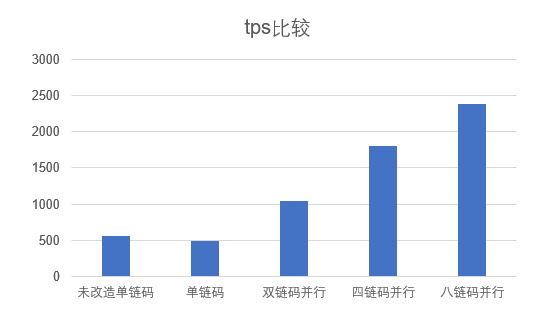

# Nisl fabric

本项目是基于hyperledger fabric 2.5版本做出的改进。增加了sharding分支，该分支解除了链码命名空间限制，实现了fabric背书阶段多链码容器并行执行。

贡献团队来自复旦大学Nisl实验室。

## Quick Start

### build

~~~bash
make all
~~~

构建方式与原版fabric没有区别。

### Usage

使用方式与原版fabric一样。唯一需要注意的在于链码的命名方式。假设原链码命名为“abstore”，则分片链码需要命名为“abstore_1_shard”，“abstore_2_shard”类似。

注意只有后缀为"_shard"的链码会被识别为分片链码，该链码只负责背书阶段模拟执行，不负责提交账本。只有原链码负责验证阶段提交账本。所有的交易最终都存储在原链码的命名空间下。

## Architecture

分片架构如图：

安装多个链码可以多链码并行执行背书，有效提高交易背书阶段的速度。基于tape的实验测试结果如下：

## Other

适合测试多链码并行的smallbank benchmark：https://github.com/hsj576/smallbank-benchmark

适合测试的fabric-java-sdk：https://github.com/hsj576/nisl-fabric-sdk